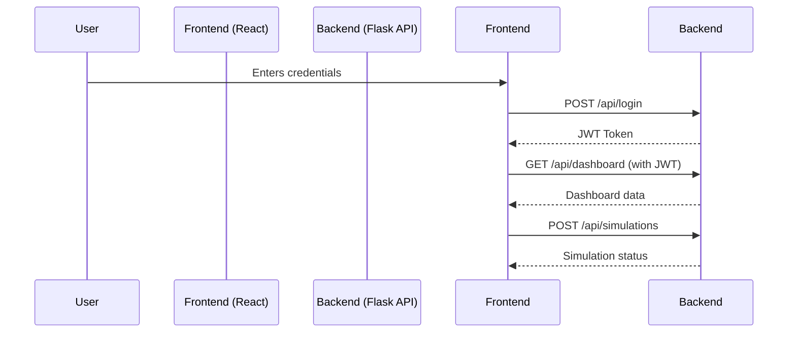

#  RSDT: Ransomware Simulation & Defense Toolkit

**RSDT** is a modern, responsive web application built for cybersecurity professionals. It allows teams to **safely simulate ransomware attacks**, **monitor key security metrics**, **manage alerts**, and **train personnel** effectively.

This project is built using a **React frontend** and a **Flask backend**, with RESTful APIs for communication. Designed for performance, scalability, and real-world security training scenarios.

---

## 📁 Project Architecture

| Component  | Technology Stack | Purpose                                                                 | URL                          |
|------------|------------------|-------------------------------------------------------------------------|------------------------------|
| **Frontend** | React, HTML, CSS, JavaScript | Graphical User Interface (GUI) for users                              | `http://localhost:5173`      |
| **Backend**  | Python Flask     | Application logic, API services, data handling, and authentication     | `http://127.0.0.1:5000`      |

---

## ⚙️ Backend Setup (Python Flask)

### 🔧 Prerequisites

- **Python** 3.11 or higher
- **pip** (Python package manager)

### 📦 Installation & Launch

1. **Navigate to the Backend Directory:**

   ```bash
   cd /home/ubuntu/backend
````

2. **Create and Activate a Virtual Environment:**

   ```bash
   python3.11 -m venv venv
   source venv/bin/activate
   ```

3. **Install Required Packages:**

   ```bash
   pip install Flask Flask-JWT-Extended Flask-CORS
   ```

4. **Run the Flask Server:**

   ```bash
   python app.py
   ```

✅ The backend server will now run at: `http://127.0.0.1:5000`

---

### 🔐 Key API Endpoints

| Method | Endpoint           | Description                           | Auth Required |
| ------ | ------------------ | ------------------------------------- | ------------- |
| `POST` | `/api/login`       | Authenticates user, returns JWT token | ❌ No          |
| `GET`  | `/api/dashboard`   | Fetch dashboard metrics               | ✅ Yes         |
| `POST` | `/api/simulations` | Start a new ransomware simulation     | ✅ Yes         |
| `GET`  | `/api/alerts`      | Get system security alerts            | ✅ Yes         |

---

## 🎨 Frontend Setup (React)

### 🔧 Prerequisites

* **Node.js** (LTS recommended)
* **pnpm**, **npm**, or **yarn**

### ⚙️ Installation & Launch

1. **Navigate to the Frontend Directory:**

   ```bash
   cd /home/ubuntu/rsdt-frontend
   ```

2. **Install Dependencies:**

   ```bash
   pnpm install   # OR: npm install
   ```

3. **Start the React Dev Server:**

   ```bash
   pnpm run dev --host
   ```

✅ The frontend will now run at: `http://localhost:5173`

---

## 🔐 Application Usage

### 🛠️ Access the App

Open your browser and navigate to: [http://localhost:5173](http://localhost:5173)

#### ▶️ Login Credentials (Default):

```txt
Username: testuser
Password: password
```

---

### 🌐 Key Features

#### 📊 Dashboard

* Displays high-level security metrics:

  * **Active Simulations**
  * **Critical Alerts**
  * **System Health**
  * **Defense Score**

#### 💣 Simulations

* View, create, and manage ransomware simulations.
* See name, status, and execution time of each simulation.

#### 🚨 Alerts

* Real-time security alerts with:

  * Severity Levels (e.g., `Critical`, `High`)
  * Descriptive alert messages

#### ⚙️ Settings

* Toggle **Dark Mode**
* Enable/disable **Notifications**
* Manage user preferences

---

## 🔐 Authentication & Security

* Uses **JWT (JSON Web Tokens)** for authentication.
* After login, JWT is stored in local storage.
* Each protected API call sends the token in headers:

```http
Authorization: Bearer <your-jwt-token>
```

---

## 📡 Communication Flow



---

## 🧪 Example API Call (Using fetch)

```javascript
fetch('http://127.0.0.1:5000/api/dashboard', {
  headers: {
    'Authorization': `Bearer ${token}`
  }
})
.then(res => res.json())
.then(data => console.log(data));
```

---

## 📂 Project Structure

```
rsdt/
├── backend/             # Flask app (API, Auth, Simulations)
│   ├── app.py
│   └── ...
├── rsdt-frontend/       # React frontend (UI)
│   ├── src/
│   └── ...
├── README.md
└── ...
```

---

## 🛠️ Future Improvements

* OAuth2 / SSO support
* Simulation logs export (PDF/CSV)
* Multi-user roles & permissions
* Integration with SIEM tools

--
---

---

---

*Last updated: October 2025*
```


## Team Members

| Name           | Email                                                         |   |
| -------------- | ------------------------------------------------------------- | - |
| Binyam Bharu   | [bharubinyamt@gmail.com](mailto:bharubinyam@gmail.com)         |   |
| Adisu Alke     | [alkeadis09@gmail.com](mailto:alkeadis09@gmail.com)           |   |
| Amanuel Nebiyu | [amanuelnebiyu00@gmail.com](mailto:amanuelnebiyu00@gmail.com) |   |
| Niya Muhammad  | [niyakedir68@gmail.com](mailto:niyakedir68@gmail.com)         |   |

---
*Last updated: October 2025*

